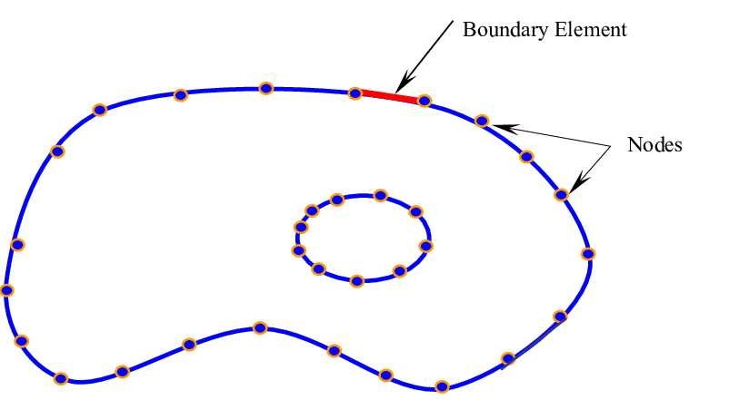

[![Documentation Status][docs-img]][docs-url]
[![Build Status][build-img]][build-url]
[![Lint with Black][lintblack-img]][lintblack-url]
[![Code Coverage][coverage-img]][coverage-url]

[![PyPI Version][pypi-img]][pypi-url]
[![Python Versions][pyversions-img]][pyversions-url]
[![License: MIT][license-img]][license-url]



# Shape

A python package for bidimensional geometric shapes boolean manipulation


### Installation:

This library is available in [PyPI][pypi-url]. To install it

```
$ pip install shapepy
```

For more details, refer to the [documentation][docs-url]

### Documentation

The documentation can be found at [shapepy.readthedocs.io][docs-url]


### Contribute

Please use the [Issues][issues-url] or refer to the email ```compmecgit@gmail.com```

<!-- Badges: -->

[lintblack-img]: https://github.com/compmec/shapepy/actions/workflows/black.yaml/badge.svg
[lintblack-url]: https://github.com/compmec/shapepy/actions/workflows/black.yaml
[docs-img]: https://readthedocs.org/projects/shapepy/badge/?version=latest
[docs-url]: https://shapepy.readthedocs.io/en/latest/?badge=latest
[pypi-img]: https://img.shields.io/pypi/v/shapepy
[pypi-url]: https://pypi.org/project/shapepy/
[build-img]: https://github.com/compmec/shapepy/actions/workflows/build.yaml/badge.svg
[build-url]: https://github.com/compmec/shapepy/actions/workflows/build.yaml
[coverage-img]: https://codecov.io/gh/compmec/shapepy/branch/main/graph/badge.svg?token=vfGMPe9W3I
[coverage-url]: https://codecov.io/gh/compmec/shapepy
[pyversions-img]: https://img.shields.io/pypi/pyversions/shapepy.svg?style=flat-square
[pyversions-url]: https://pypi.org/project/shapepy/
[license-img]: https://img.shields.io/pypi/l/ansicolortags.svg
[license-url]: https://github.com/compmec/shapepy/blob/main/LICENSE.md
[pypi-url]: https://pypi.org/project/shapepy/
[issues-url]: https://github.com/compmec/shapepy/issues
