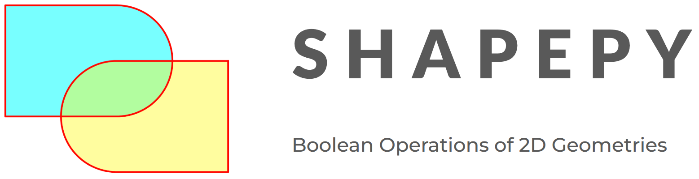

Documentation
=============

*shapepy* is a python package for bidimensional geometry manipulation.

.. toctree::
   :maxdepth: 1
   :caption: Using the library:

   rst/installation
   rst/get_started
   rst/primitive
   rst/geometry
   rst/boolean
   rst/features

.. toctree::
   :maxdepth: 1
   :caption: Theory

   rst/theory

.. toctree::
   :maxdepth: 2
   :caption: References

   rst/references

Support
-------

This package is slowly increasing its number of tests, if you find a bug, please notify to be corrected and be inserted in the tests.

Raise an issue on the `GitHub issue tracker
<https://github.com/shapepy/issues>`_ or contact me at
`compmecgit@gmail.com <mailto:compmecgit@gmail.com>`_.

If you have a request for a feature to be added to the *shapepy* package, please don't hesitate to get in touch

License
-------

The project is licensed under the MIT license.
