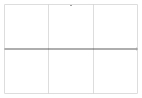
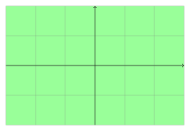
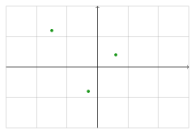
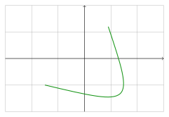
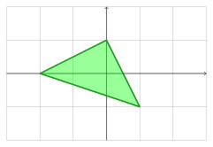
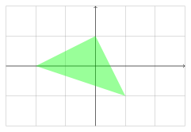
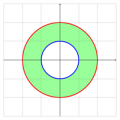
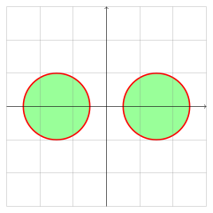

.. _boolean:

=======
Boolean
=======

This section focus only on the `shapepy.bool2d` submodule.

It defines:

* `Empty`: An empty set. Meaning the subset of the plane that contains no point inside it
* `Whole`: The complementar of the empty set. Meaning it contains all the points of the entire plane
* `SinglePoint`: A subset that contains only one point
* `SingleCurve`: A subset that contains only a continuous curve
* `SimpleShape`: A subset that defines a closed region.

The standard boolean operations are `NOT`, `OR` and `AND`.

.. _bool2d_empty:

EmptyShape
----------

An `EmptyShape` instance is an empty set that contains no point inside it.

.. code-block:: python
   
   from shapepy import EmptyShape
   empty = EmptyShape()  # Create an empty shape

.. _bool2d_whole:

WholeShape
----------

A `WholeShape` instance is the entire plane.

.. code-block:: python
   
   from shapepy import WholeShape
   whole = WholeShape()  # Create a whole shape

.. _bool2d_point:

SinglePoint
-----------

A `SinglePoint` instance is only a point on the plane.
We create a **geometric point** and then a `SinglePoint` wraps it 

.. code-block:: python
   
   from shapepy import SinglePoint, cartesian
   geom_point = cartesian(0.4, -0.6)  # Create a geometric point
   point = SinglePoint(geom_point)

.. _bool2d_curve:

SingleCurve
-----------

A `SingleCurve` instance contains a continuous curve on the plane.
We create a **geometric geometric** and then a `SingleCruve` wraps it 

.. code-block:: python
   
   from shapepy import SingleCurve, FactorySegment
   points = [(0.9, 1.2), (1.9, -1.8), (-1.5, -1.0)]
   geom_curve = FactorySegment.bezier(points)  # Create a geometric curve
   curve = SingleCurve(geom_curve)

To create different or more complex geometric curves, check out :ref:`geometry_curve`

.. _bool2d_simple:

SimpleShape
-----------

A `SimpleShape` instance defines a region in the plane, defined by a `JordanCurve`.
You can use the `Primitive` class that some useful functions to create `SimpleShape`, but you can create from a `JordanCurve`.

.. code-block:: python
   
   from shapepy import SimpleShape, FactoryJordan
   points = [(0, 1), (1, -1), (-2, 0)]
   jordan = FactoryJordan.polygon(points)
   shape = SimpleShape(jordan)

By default, the simple shape contains its boundary, but it's possible to remove its boundary.

.. code-block:: python
   # ... same as before ...
   shape = SimpleShape(jordan, boundary=False)

To create different or more complex jordan curves, check out :ref:`geometry_jordan`.

.. _bool2d_connected:

ConnectedShape
--------------

A `ConnectedShape` is a shape that is the intersection of some shapes.
By definition, for each pair of points inside the connected shape, there is a continous path connecting both points.

.. code-block:: python
   
   from shapepy import Primitive, ConnectedShape
   external = Primitive.circle([(0, 1), (1, -1), (-2, 0)])
   internal = Primitive.polygon([(0, 0), (-1, 0), (-0.5, 0.5)])
   shape = ConnectedShape([external, internal])

.. _bool2d_disjoint:

DisjointShape
-------------

A `DisjointShape` is a shape that is the union of some shapes that are disjoint with each other.
To build up a `DisjointShape`, it's required a group of connected shapes.

.. code-block:: python
   
   from shapepy import Primitive, DisjointShape
   left_shape = Primitive.circle(center=(-1.5, 0), radius=1)
   right_shape = Primitive.circle(center=(1.5, 0), radius=1)
   disjoint_shape = DisjointShape([left_shape, right_shape])

