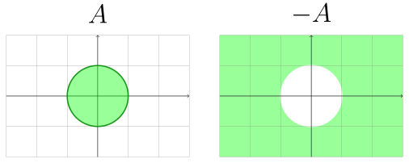
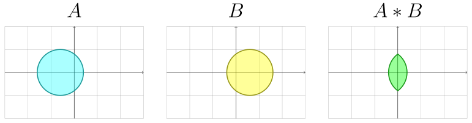
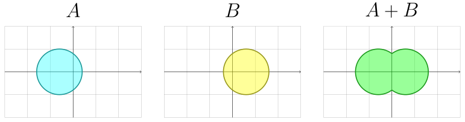
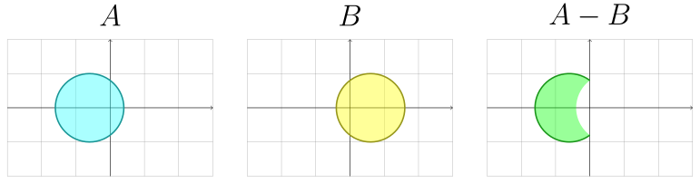
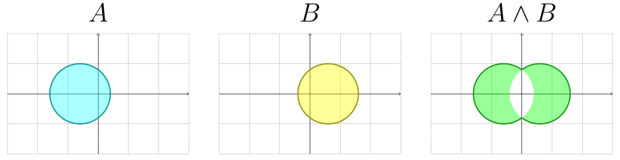
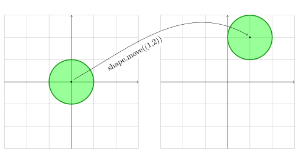
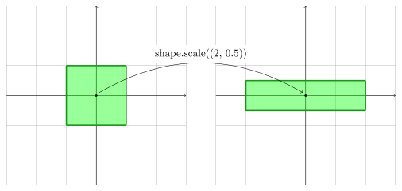
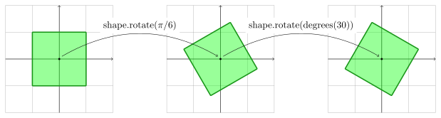

.. _boolean:

=======
Boolean
=======

This section focus only on the `shapepy.bool2d` submodule.

This submodule basically defines subsets of the plane and the boolean operations between them.

-----------------------------------------------------------------------------------------------------------

Classes
=======

The most used classes used in the ``shapepy.bool2d`` submodule are:

* **EmptyShape**: An empty set. Meaning the subset of the plane that contains no point inside it
* **WholeShape**: The complementar of the empty set. Meaning it contains all the points of the entire plane
* **SinglePoint**: A subset of the plane that contains only one point
* **SingleCurve**: A subset of the plane that contains only a continuous curve
* **SimpleShape**: A subset of the plane that defines a closed region.

Other which are more advanced and should not be instantiated directly.

* **ConnectedShape**: A subset of the plane, defined by the intersection of some **SimpleShape**.
* **DisjointShape**: A subset of the plane, defined by the union of some **SimpleShape** or **ConnectedShape**.
* **LazyOr**: Represents an union of subsets of the plane. 
* **LazyAnd**: Represents an intersection of subsets of the plane. 
* **LazyNot**: Represents the complementar subset of a given subset. 

-----------------------------------------------------------------------------------------------------------

.. _bool2d_empty:

----------
EmptyShape
----------

An `EmptyShape` instance is an empty set that contains no point inside it.

.. code-block:: python
   
   >>> from shapepy import EmptyShape
   >>> empty = EmptyShape()  # Create an empty shape

.. image:: ../img/bool2d/empty_shape.svg
   :width: 50 %
   :alt: Example of EmptyShape instance
   :align: center

-----------------------------------------------------------------------------------------------------------

.. _bool2d_whole:

----------
WholeShape
----------

A `WholeShape` instance is the entire plane.

.. code-block:: python
   
   >>> from shapepy import WholeShape
   >>> whole = WholeShape()  # Create a whole shape

.. image:: ../img/bool2d/whole_shape.svg
   :width: 50 %
   :alt: Example of WholeShape instance
   :align: center

-----------------------------------------------------------------------------------------------------------

.. _bool2d_point:

-----------
SinglePoint
-----------

A `SinglePoint` instance is only a point on the plane.
We create a **geometric point** and then a `SinglePoint` wraps it 

.. code-block:: python
   
   >>> from shapepy import SinglePoint, cartesian
   >>> geom_point = cartesian(0.4, -0.6)  # Create a geometric point
   >>> point = SinglePoint(geom_point)  # Create a SinglePoint

.. image:: ../img/bool2d/three_points.svg
   :width: 50 %
   :alt: Example of three points on the plane
   :align: center

-----------------------------------------------------------------------------------------------------------

.. _bool2d_curve:

-----------
SingleCurve
-----------

A `SingleCurve` instance contains a continuous curve on the plane.
We create a **geometric geometric** and then a `SingleCruve` wraps it 

.. code-block:: python
   
   >>> from shapepy import SingleCurve, FactorySegment
   >>> points = [(0.9, 1.2), (1.9, -1.8), (-1.5, -1.0)]
   >>> geom_curve = FactorySegment.bezier(points)  # Create a geometric curve
   >>> curve = SingleCurve(geom_curve)

.. image:: ../img/bool2d/curve_example.svg
   :width: 50 %
   :alt: Example of bezier curve curve on the plane
   :align: center

To create different or more complex geometric curves, check out :ref:`geometry`

-----------------------------------------------------------------------------------------------------------

.. _bool2d_simple:

-----------
SimpleShape
-----------

A `SimpleShape` instance defines a region in the plane, defined by a `JordanCurve`.
If the jordan curve is counter-clockwise, then the shape is the interior region, otherwise it's the external region.

You can use the `Primitive` class that some useful functions to create `SimpleShape`, but you can create from a `JordanCurve`.

.. code-block:: python
   
   >>> from shapepy import SimpleShape, FactoryJordan
   >>> points = [(0, 1), (1, -1), (-2, 0)]
   >>> jordan = FactoryJordan.polygon(points)
   >>> shape = SimpleShape(jordan)

.. image:: ../img/bool2d/simple_example.svg
   :width: 50 %
   :alt: Example of a closed polygonal simple shape
   :align: center

Simple shape contains its **boundary** as default.
You can remove it with the parameter ``boundary``.

.. code-block:: python
   # ... same as before ...
   >>> shape = SimpleShape(jordan, boundary=False)

.. image:: ../img/bool2d/opensimple_example.svg
   :width: 50 %
   :alt: Example of an open polygonal simple shape
   :align: center

To create different or more complex jordan curves, check out :ref:`geometry_jordan`.

-----------------------------------------------------------------------------------------------------------

.. _bool2d_connected:

--------------
ConnectedShape
--------------

A `ConnectedShape` is a shape that is the intersection of some shapes.
By definition, for each pair of points inside the connected shape, there is a continous path connecting both points.

.. code-block:: python
   
   >>> from shapepy import Primitive, ConnectedShape
   >>> external = Primitive.circle([(0, 1), (1, -1), (-2, 0)])
   >>> internal = Primitive.polygon([(0, 0), (-1, 0), (-0.5, 0.5)])
   >>> shape = ConnectedShape([external, internal])

.. image:: ../img/bool2d/hollow_circle.svg
   :width: 50 %
   :alt: Example of a connected shape: a hollow circle
   :align: center

.. warning::
   This class normally is instantiated as result of the boolean operations. We recommend not to use it directly.

-----------------------------------------------------------------------------------------------------------

.. _bool2d_disjoint:

-------------
DisjointShape
-------------

A `DisjointShape` is a shape that is the union of some disjoint shapes.

To build up a `DisjointShape`, it's required a group of connected or simple shapes.

.. code-block:: python
   
   >>> from shapepy import Primitive, DisjointShape
   >>> left_shape = Primitive.circle(center=(-1.5, 0), radius=1)
   >>> right_shape = Primitive.circle(center=(1.5, 0), radius=1)
   >>> disjoint_shape = DisjointShape([left_shape, right_shape])

.. image:: ../img/bool2d/two_circles.svg
   :width: 50 %
   :alt: Example of a disjoint shape
   :align: center

.. warning::
   This class normally is instantiated as result of the boolean operations. We recommend not to use it directly.

-----------------------------------------------------------------------------------------------------------

Operations
==========

You can use the boolean operations between the shapes above.
The operators are :

* :ref:`bool2d_not`
* :ref:`bool2d_or`
* :ref:`bool2d_and`
* :ref:`bool2d_sub`
* :ref:`bool2d_xor`

.. _bool2d_not:

-------------
Inversion NOT
-------------

For any shape ``A``, the ``-A`` gives the complementar subset.

    
To compute the complementar of a circle:

.. code-block:: python
   
   >>> from shapepy import Primitive
   >>> A = Primitive.circle(radius=1, center=(0, 0))
   >>> B = -A

.. note::
   The operator ``~`` can also be used to invert a shape.
   While ``-A`` computes the inversion directly (that can be costy),
   the ``~A`` gives you a **Lazy** evaluator and it's used for speed up computations.

   For example, while ``~(~A)`` gives directly ``A`` (the same instance),
   the ``-(-A)`` needs two inversions, the creation of new two objects.
 
-----------------------------------------------------------------------------------------------------------

.. _bool2d_and:

---------------
Conjunction AND
---------------

For any two shapes ``A`` and ``B``, the conjunction/intersection is given by ``A * B``.

To compute the intersection of two shapes:

.. code-block:: python
   
   >>> from shapepy import Primitive
   >>> A = Primitive.circle(radius=1, center=(-0.6, 0))
   >>> B = Primitive.circle(radius=1, center=(0.6, 0))
   >>> C = A * B

.. note::
   The operator ``&`` can also be used to get the intersection between shapes.
   While ``A * B`` computes the intersection directly (that can be costy),
   the ``A & B`` gives you a **Lazy** evaluator and it's used for speed up computations.

-----------------------------------------------------------------------------------------------------------

.. _bool2d_or:

--------------
Disjunction OR
--------------

For any two shapes ``A`` and ``B``, the disjunction/union is given by ``A + B``.

To compute the union of two shapes:

.. code-block:: python
   
   >>> from shapepy import Primitive
   >>> A = Primitive.circle(radius=1, center=(-0.6, 0))
   >>> B = Primitive.circle(radius=1, center=(0.6, 0))
   >>> C = A + B

.. note::
   The operator ``|`` can also be used to get the union between shapes.
   
   While ``A + B`` computes the union directly (that can be costy),
   the ``A | B`` gives you a **Lazy** evaluator and it's used for speed up computations.

-----------------------------------------------------------------------------------------------------------

.. _bool2d_sub:

---------------
Subtraction SUB
---------------

You can subtract two subsets: ``A - B``.

To subtract two shapes:

.. code-block:: python
   
   >>> from shapepy import Primitive
   >>> A = Primitive.circle(radius=1, center=(-0.6, 0))
   >>> B = Primitive.circle(radius=1, center=(0.6, 0))
   >>> C = A - B

-----------------------------------------------------------------------------------------------------------

.. _bool2d_xor:

-------------------
Exclusive union XOR
-------------------

You can compute the exclusive union with : ``A ^ B``.

To compute the intersection of two shapes:

.. code-block:: python
   
   >>> from shapepy import Primitive
   >>> A = Primitive.circle(radius=1, center=(-0.6, 0))
   >>> B = Primitive.circle(radius=1, center=(0.6, 0))
   >>> C = A ^ B

-----------------------------------------------------------------------------------------------------------

.. _bool2d_contains:

-----------
Contains IN
-----------

You can check if a subset is inside another : ``A in B``.

.. code-block:: python
   
   >>> from shapepy import Primitive
   >>> A = Primitive.circle(radius=2, center=(0, 0))
   >>> B = Primitive.circle(radius=1, center=(0, 0))
   >>> B in A
   true
   >>> A in B
   false

-----------------------------------------------------------------------------------------------------------

Transformations
===============

.. _bool2d_move:

----
Move
----

Translate the entire shape by an amount ``(x, y)``

.. code-block:: python
   
   >>> from shapepy import Primitive
   >>> # Creates a circle of radius 1 and centered at origin (0, 0)
   >>> circle = Primitive.circle()
   >>> # Now the circle has radius 1 and center at (1, 2)
   >>> circle = circle.move((1, 2))

------------------------------------------------------------------------------------------

.. _bool2d_scale:

-----
Scale
-----

Scale the entire shape in horizontal and vertical directions

.. code-block:: python

   >>> from shapepy import Primitive
   >>> # Create square of side 2
   >>> quare = Primitive.square(side = 2)
   >>> # Scales a square into a rectangle of width 2 and height 0.5
   >>> square.scale((2, 0.5))

------------------------------------------------------------------------------------------

.. _bool2d_rotate:

------
Rotate
------

Rotate counter-clockwise the entire shape

.. code-block:: python

   >>> from math import pi
   >>> from shapepy import Primitive
   >>> # Create square of side 2
   >>> square = Primitive.square(side = 2)
   >>> # Rotate the square in pi/6 radians
   >>> square = square.rotate(pi/6)
   >>> # Or in 30 degrees
   >>> from shapepy.scalar.angle import degrees
   >>> square = square.rotate(degrees(30))
