Primitive
======================

Introduction
------------

These functions are divided in three groups:

* Geometric primitives: ``regular_polygon``, ``circle``, etc
* Geometric transformations: ``move``, ``rotate``, ``scale`` and ``invert``
* Geometric operations: ``add``, ``sub``, ``mult`` and ``xor``

.. note::
   Although this page contains smooth curves, the current code only works with polygons.

To see more primitive shapes and their parameters, type ``help(section.shape.primitives)``.
The most common are:

* ``regular_polygon(nsides)``: Creates a circumscribed regular polygon of ``nsides``-sides centered at ``(0, 0)``. The circumscribed circle has radius 1 and the first vertex is ``(1, 0)``.
* ``circle(npts = 100)``: Creates a circle of radius 1 and center at ``(0, 0)``. The argument is the discretization value: fow now we only work with polygons and a 100-side polygon is fair enough to a circle.

--------------------------------------------------------------------------------

Transformations
-----------------------------

Move
^^^^^^^^^^^^^^^^^^^^^^^^^^^^^

Translate the entire shape by an amount ``(x, y)``

.. code-block:: python
   
   # Creates a circle of radius 1 and centered at origin (0, 0)
   circle = shape.primitive.circle()
   # Now the circle has radius 1 and center at (1, 2)
   circle.move(1, 2)

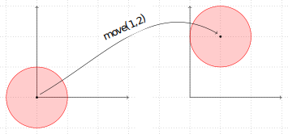

Rotate
^^^^^^^^^^^^^^^^^^^^^^^^^^^^^

Rotate counter-clockwise the entire shape

.. code-block:: python

   # Create square of side 1
   square = section.shape.primitive.square()
   # Rotate the square in 45 degrees
   square.rotate_degrees(45)
   # Or in pi/4 radians
   square.rotate_radians(pi/4)

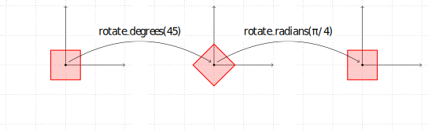

Scale
^^^^^

Scale the entire shape in two directions

.. code-block:: python

   # Create square of side 1
   square = section.shape.primitive.square()
   # Scales a square into a rectangle of width 2 and height 3
   square.scale(2, 3)

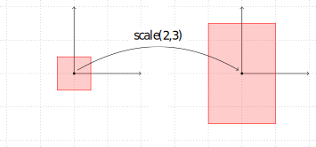

Invert
^^^^^^

Since the curves have orientation, it's possible to invert their orientation. 

.. code-block:: python

   # Create any shape, positive at counter-clockwise
   square = section.shape.primitive.square()
   # Change orientation to clockwise, negative
   square.invert()

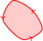
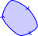

--------------------------------------------------------------------------------

Operations
-----------------------------

It's possible to operate between shapes by usign ``+``, ``-``, ``*`` and ``^``.

Sum / Union / logic OR
^^^^^^^^^^^^^^^^^^^^^^

The sum between two shapes is mathematically a union of two sets

.. code-block:: python

   # Create two positive shapes
   circle = section.shape.primitive.circle()
   square = section.shape.primitive.square()
   # Sum both
   newshape = circle - square

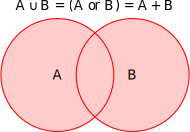

A concrete example:

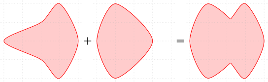

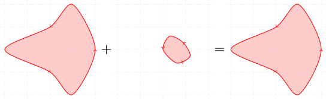

Subtraction
^^^^^^^^^^^

The subtraction between two positive shapes means take out all part of :math:`A` such is inside :math:`B`. 

.. code-block:: python

   # Create two positive shapes
   circle = section.shape.primitive.circle()
   square = section.shape.primitive.square()
   # Subtract
   newshape = circle - square

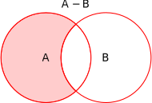

With orientation:

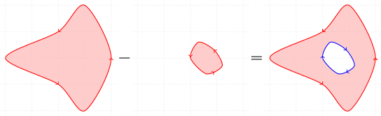

The subtraction of two positives is also a sum of a positive and a negative shape:

.. figure:: ../img/shape/sum_red_blue_mesh.svg
   :width: 70%
   :alt: Example of sum of a positive and negative shapes
   :align: center

Multiplication / Intersection / logic AND
^^^^^^^^^^^^^^^^^^^^^^^^^^^^^^^^^^^^^^^^^

The multiplication between two positive shapes means get the intersection between the shapes.
It means, the common region between them.

.. code-block:: python

   # Create two positive shapes
   circle = section.shape.primitive.circle()
   square = section.shape.primitive.square()
   # Subtract
   newshape = circle * square

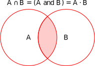

XOR Operator
^^^^^^^^^^^^

The xor between two positive shapes. For this operator, we use the symbol ``^``.

.. code-block:: python

   # Create two positive shapes
   circle = section.shape.primitive.circle()
   square = section.shape.primitive.square()
   # Subtract
   newshape = circle ^ square

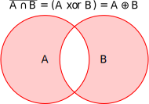

--------------------------------------------------------------------------------

Structure
-----------------------------

Any shape is a ``Shape`` object

.. code-block:: python
   
   square = section.shape.primitive.square()
   print(type(square))
   # >> Shape

A shape is a sum of many curves, which are ``JordanCurve`` instances.
Since it's a simple square, it has only one curve inside:
   
.. code-block:: python

   print(len(square.curves))
   # >> 1
   curve = square.curves[0]
   print(type(curve))
   # >> JordanCurve

Each curve has points inside, which are in fact the polygon vertex

.. code-block:: python
   
   # Getting the polygon vertex
   points = jordancurve.points
   print(type(points))
   # >> np.ndarray
   print(points.shape)
   # >> (5, 2)
   print(points)
   # >> [[ 0.5  0.5]
   # [-0.5  0.5]
   # [-0.5 -0.5]
   # [ 0.5 -0.5]
   # [ 0.5  0.5]]

.. note:: 
   To create your custom polygon, it's suggested to make the points array by your own: 

   .. code-block:: python
   
      # Create a distorted diamond
      points = [[1, 0], [0, 1], [-2, 0], [0, -1], [1, 0]]
      curve = section.shape.JordanCurve(points)
      diamond = section.shape.Shape(curve)

   .. figure:: ../img/shape/distorted-diamond.svg
      :width: 40%
      :alt: Example of distorted diamond
      :align: center
