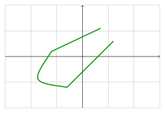

.. _geometry:

========
Geometry
========

This section focus only on the ``shapepy.geometry`` submodule.

* :ref:`geometry_point`
* :ref:`geometry_segment`
* :ref:`geometry_usegment`
* :ref:`geometry_piecewise`
* :ref:`geometry_upiecewise`
* :ref:`geometry_jordan`

We use these geometries in the submodule ``shapepy.bool2d`` later.

-----------------------------------------------------------------------------------------------------------

.. _geometry_point:

Point2D
=======

A ``Point2D`` represents a point in the plane.
It can be created from the cartesian coordiantes ``(x, y)`` 

.. code-block:: python
   
   >>> from shapepy.geometry import cartesian
   >>> pointA = cartesian(1.2, 0.8)

or also from the polar coordinates ``radius`` and ``angle``.

.. code-block:: python
   
   >>> from shapepy.geometry import polar
   >>> from shapepy.scalar.angle import degrees
   >>> angle = degrees(110)
   >>> pointB = polar(6, angle)

The package is based on projective geometry hence the `point at infty` exists.
To create one, use the ``polar`` function with ``infinite`` radius. 

.. code-block:: python
   
   >>> radius = float("inf")
   >>> angle = degrees(-55)
   >>> pointC = polar(radius, angle)

-----------------------------------------------------------------------------------------------------------

.. _geometry_segment:

Segment
=======

A segment is a smooth curve that has no `breaks` inside it.
You can create a segment from the **FactorySegment**.

For example, the **bezier** can create a linear segment connecting the points ``(1, 2)`` and ``(4, 0)``.

.. code-block:: python
   
   from shapepy.geometry.factory import FactorySegment

   linear_segment = FactorySegment.bezier([(1.2, 0.6), (-0.6, -1)])

The segment is parametrized hence you can evaluate it to get an intermediate point.

.. code-block:: python
   
   >>> linear_segment(0)  # The first point
   (1.2, 0.6)
   >>> linear_segment(1)  # The last point
   (-0.6, -1)
   >>> linear_segment(0.5)  # The middle point
   (0.3, -0.2)

To create a more complex segment, you need the parametrized functions ``x`` and ``y`` from the ``shapepy.analytic``.
For example, you can create polynomials of different degrees

.. math::
   x(t) = t^3 + 3 \cdot t - \frac{3}{2}
.. math::
   y(t) = -4 \cdot t^2 + 6 \cdot t - \frac{6}{5}

.. code-block:: python
   
   >>> from shapepy.analytic import Polynomial
   >>> xfunc = Polynomial([-1.5, 3, 0, 1])
   >>> yfunc = Polynomial([-1.2, 6, -4])
   >>> segment = Segment(xfunc, yfunc)
   >>> segment(0)  # Start point
   (-1.5, -1.2)
   >>> segment(1)  # End point
   (2.5, 0.8)

.. note::
   Mathematically speaking, a ``Segment`` is a :math:`C^{\infty}` curve defined in a continous domain.

-----------------------------------------------------------------------------------------------------------

.. _geometry_usegment:

Unparametrized Segment
======================

A ``USegment`` is a wrapper of the ``Segment``, but the parametrization is ignored, but the orientation is kept.

It comes from the fact a curve can be parametrized in many ways. For example, a quarter of circle can be written as

.. math::
   p(t) := \left(\cos \dfrac{\pi t}{2}, \ \sin \dfrac{\pi t}{2}\right) \ \ \ \ \ \text{with} \ t \in \left[0, \ 1\right]

But it can also be written as

.. math::
   q(t) := \left(\dfrac{1-t^2}{1+t^2}, \ \dfrac{2t}{1+t^2}\right) \ \ \ \ \ \text{with} \ t \in \left[0, \ 1\right]

Although they give the same set of points :math:`(x, y)` the parametric curve are not equal: :math:`p(t) \ne q(t)`.

.. code-block:: python
   
   >>> from shapepy.geometry.factory import FactorySegment
   >>> from shapepy.geometry.unparam import USegment
   >>> # Creates a liner segment between (1, 2) and (4, 0)
   >>> linear_segment = PlanarBezier([(1, 2), (4, 0)])
   >>> usegment = USegment(linear_segment)

-----------------------------------------------------------------------------------------------------------

.. _geometry_piecewise:

Piecewise curve
===============

A ``PiecewiseCurve`` is a continous curve that is the concatenation of some ``Segment``.
The **end point** of a segment must be the same as the **start point** of the next segment.

The piecewise allow having some break points. The easiest example is a polygonal:

.. code-block:: python
   
   >>> from shapepy.geometry.factory import FactorySegment
   >>> linearA = PlanarBezier([(1.2, 0.6), (-0.6, -1.2)])
   >>> quadraticB = PlanarBezier([(-0.6, -1.2), (-2, -1), (-1.2, 0.2)])
   >>> linearC = PlanarBezier([(-1.2, 0.2), (0.7, 1.1)])
   >>> curve = PiecewiseCurve([linearA, quadraticB, linearC])

-----------------------------------------------------------------------------------------------------------

.. _geometry_upiecewise:

Unparametrized Piecewise curve
==============================

A ``UPiecewiseCurve`` wraps the ``PiecewiseCurve``, but ignores the parametrization, but the orientation is kept.

The piecewise allow having some break points. The easiest example is a polygonal:

.. code-block:: python
   
   >>> from shapepy.geometry.factory import FactorySegment
   >>> from shapepy.geometry.piecewise import PiecewiseCurve
   >>> from shapepy.geometry.unparam import UPiecewiseCurve
   >>> linearA = PlanarBezier([(1.2, 0.6), (-0.6, -1.2)])
   >>> quadraticB = PlanarBezier([(-0.6, -1.2), (-2, -1), (-1.2, 0.2)])
   >>> linearC = PlanarBezier([(-1.2, 0.2), (0.7, 1.1)])
   >>> curve = PiecewiseCurve([linearA, quadraticB, linearC])
   >>> ucurve = UPiecewiseCurve(curve)

-----------------------------------------------------------------------------------------------------------

.. _geometry_jordan:

Jordan Curve
============

A **Jordan Curve** is a ``UPiecewiseCurve``, which is closed and doesn't intersect itself.
It also has an orientation: It is **positive** if it is **counter-clockwise**.

You can use the ``FactoryJordan`` to create a jordan curve. 
To create a polygonal shape, you can do:

.. code-block:: python
   
   >>> from shapepy.geometry.factory import FactoryJordan
   >>> vertices = [(-1, -1), (1, -1), (2, 0), (0, 1)]
   >>> jordan = FactoryJordan.polygonal(vertices)

.. figure:: ../img/geometry/jordan_curve.svg
   :width: 70%
   :alt: Example of a polygonal jordan curve
   :align: center

To create more complex jordan curves, you need to give the segments.

.. code-block:: python
   
   >>> from shapepy.geometry.jordan import JordanCurve
   >>> from shapepy.geometry.factory import FactorySegment
   >>> linearA = PlanarBezier([(1, 1), (1, 0)])
   >>> linearB = PlanarBezier([(0, -1), (0, -1)])
   >>> quadraticC = PlanarBezier([(0, -1), (-1, -1), (-1, 1)])
   >>> quadraticD = PlanarBezier([(-1, 1), (0, 0), (1, 1)])
   >>> jordan = JordanCurve([linearA, linearB, quadraticC, quadraticD])

