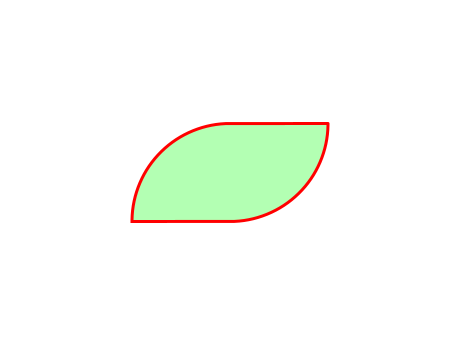

.. _get_started:

===========
Get started
===========

This library allows you to operate between **Shapes**, for example, the two shapes bellow can be united or can be intersected:

.. figure:: ../img/shape/base.svg
   :width: 50%
   :alt: Superposition of two shapes
   :align: center

|pic1|  |pic2|

.. |pic1| image:: ../img/shape/union.svg
   :width: 49 %

---------------------------------------------------

The initial step is creating shapes. There's the class ``Primitive`` which have functions such ``square`` and ``circle`` that will help us to generate basic shapes. First we create the left shape by uniting a **circle** and a **square**

.. code-block:: python

    from compmec.shape import Primitive

    # Create the left shape
    circle = Primitive.circle(radius = 1, center = (0, 0))
    square = Primitive.square(side = 2, center = (-1, 0))
    left_shape = square + circle  # Unite shapes

Then we create the right shape by moving and rotating the left shape

.. code-block:: python

    from copy import deepcopy
    # Create the right shape
    right_shape = deepcopy(left_shape)
    right_shape.rotate(180, degrees = True)
    right_shape.move(0, -1)

We can plot both shapes by using ``matplotlib``

.. code-block:: python

    from compmec.shape import PlotShape

    # Create ploter
    plt = PlotShape()
    
    # Plot the left shape
    plt.plot(left_shape, fill_color = "cyan")
    # Plot the right shape
    plt.plot(right_shape, fill_color = "yellow")
    
    # Show images on screen
    plt.show()

Now we unite and intersect the ``left_shape`` and ``right_shape``:

.. code-block:: python

    # Unite left and right. You can also use +
    union_shape = left_shape | right_shape
    
    # Intersect left and right. You can also use *
    intersection_shape = left_shape & right_shape

We finally plot the figure

.. code-block:: python

    # Plot the union shape
    plt = PlotShape()
    plt.plot(union_shape)

    # Plot the intersection shape
    plt = PlotShape()
    plt.plot(intersection_shape)

    # Show images on screen
    plt.show()
    
It's also possible to get properties of the shape, such as **area**, **momentum of area** and **inertia of area**:

.. code-block:: python

    from compmec.shape import IntegrateShape

    area = IntegrateShape.area(union)  # 9.571110535844964

    moment_x = IntegrateShape.polynomial(union, 1, 0)  # -7.502679e-16
    moment_y = IntegrateShape.polynomial(union, 0, 1)  # -4.785555267922482

    inertia_xx = IntegrateShape.polynomial(union, 2, 0)  # 11.059522875398848
    inertia_xy = IntegrateShape.polynomial(union, 1, 1)  # -3.416464745608603
    inertia_yy = IntegrateShape.polynomial(union, 0, 2)  # 8.511945596141624

Once you got the main idea, you can create your own shape.
We recomend now see the next topic :ref:`primitive`