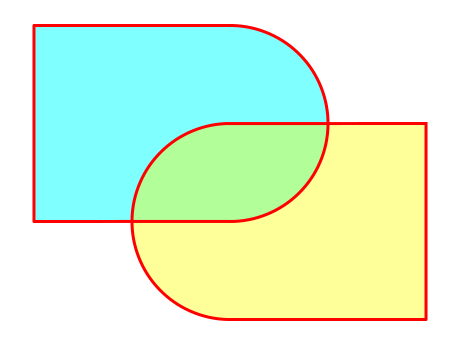
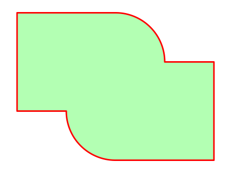
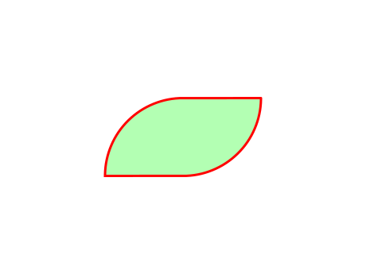
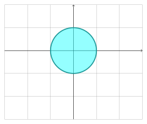
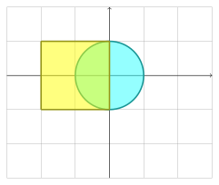
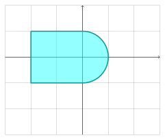
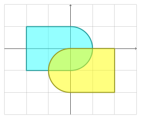
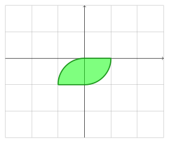

.. _get_started:

===========
Get started
===========

This library allows you to operate between **Shapes**, for example, the two shapes bellow can be united or can be intersected:

|pic1|  |pic2|

---------------------------------------------------

Baby steps
==========

The first step is creating shapes to then operate them.
To create a **circle**, use the **Primitive**:

.. code-block:: python

    from shapepy import Primitive

    circle = Primitive.circle(radius = 1, center = (0, 0))

Then we create a **square**

.. code-block:: python

    square = Primitive.square(side = 2, center = (-1, 0))

And hence we unite both shapes to create the *left* shape

.. code-block:: python

    left = square + circle  # Unite

To create the *right* shape we can copy and transform using the functions **rotate** and **move**.

.. code-block:: python

    from copy import deepcopy
    from math import pi
    
    right = deepcopy(left).rotate(pi).move((0, -1))

Now, we can intersect both the *left* and *right* shape, to obtain

.. code-block:: python

    intersection = left * right  # Intersection

------------------------------------------------------------------------------

-----------------------------------------------------------------------

What I can do
=============

Here we give you some examples. The entire list can be found in the :ref:`features`.

----------------
How to visualize
----------------

The shapes don't show by themselves, so se can use the ``matplotlib`` to visualize them.
We create an instance of ``PlotShape`` which is pretty similar to ``matplotlib.pyplot``:

.. code-block:: python

    from shapepy import PlotShape

    # Create ploter
    plt = PlotShape()
    
    # Plot the left shape
    plt.plot(left, fill_color = "cyan")
    # Plot the right shape
    plt.plot(right, fill_color = "yellow")
    
    # Show images on screen
    plt.show()

Now we unite and intersect the ``left`` and ``right``:

.. code-block:: python

    # Unite left and right
    union = left + right
    
    # You can also use * for intersect
    intersection = left * right

We finally plot the figure

.. code-block:: python

    # Plot the union shape
    plt = PlotShape()
    plt.plot(union)

    # Plot the intersection shape
    plt = PlotShape()
    plt.plot(intersection)

    # Show images on screen
    plt.show()

------------------
Computing the area
------------------

-------------------
Computing integrals
-------------------

-------
Meshing
-------

The optional library ``gmsh`` can be used to generate meshes from shapes.

-----------------------------------------------------------------------

Next steps
==========

Now you know the basics, you can attack different points independently.

* 
* What you can do with the shapes: :ref:`features`
* All the basic primitives: :ref:`primitive`
* How to create complex shapes: :ref:`advanced`
* To know the specifics: :ref:`theory`
