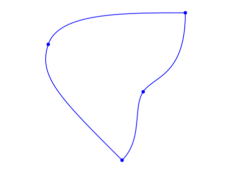
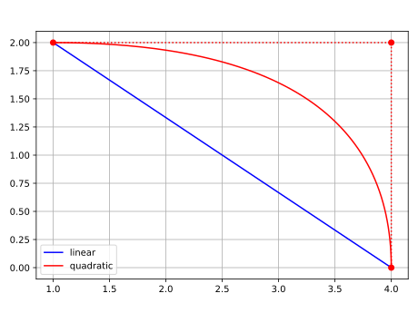
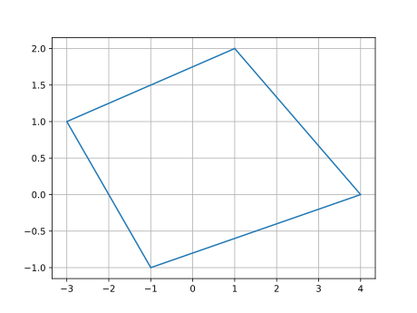
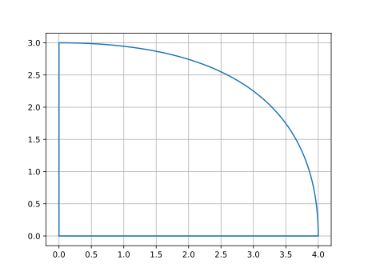

.. _jordan_curve:

============
Jordan Curve
============

------------
Introduction
------------

Jordan Curve is a continuous closed curve which doesn't intersect itself.

.. figure:: ../img/theory/jordan_curve.svg
   :width: 70%
   :alt: Example of jordan curves 
   :align: center

For our purpose, we use oriented jordan curve by setting a **positive** direction as **counter-clockwise**.

Although a jordan curve can be very general, we restrict and use only jordan curves which are piecewise smooth curves. We call each piece as a ``segment``, a planar bezier curve.

------------------
Creating a segment
------------------

A ``segment`` is a ``PlanarBezier`` instance. You create a new instance by passing the ``ctrlpoints`` of the curve. For example, we have a linear and a quadratic segment in the figure bellow 

.. code-block:: python
   
   from compmec.shape import PlanarBezier
   # Creates a liner segment between (1, 2) and (4, 0)
   linear_segment = PlanarBezier([(1, 2),
                                  (4, 0)])
   # Creates a quadratic segment
   quadratic_segment = PlanarBezier([(1, 2),
                                     (4, 2),
                                     (4, 0)])

-----------------------
Creating a jordan curve
-----------------------

There are 4 ways to create a ``JordanCurve`` instance:

* From vertices: ``JordanCurve.from_vertices``
* From segments: ``JordanCurve.from_segments``
* From bezier control points: ``JordanCurve.from_ctrlpoints``
* From full curve: ``JordanCurve.from_full_curve``

From vertices
-----------------------

This method creates polygonal shapes only

.. code-block:: python
   
   from compmec.shape import JordanCurve
   
   # Create a list of vertices
   vertices = [(1, 2), (4, 0), (-1, -1), (-3, 1)]
   # Creates a quadrilateral jordan
   jordan = JordanCurve.from_vertices(vertices)

From segments
-----------------------

This method can create shape of any degree

.. code-block:: python
   
   from compmec.shape import PlanarBezier, JordanCurve
   segment0 = PlanarBezier([(0, 0), (4, 0)])
   segment1 = PlanarBezier([(4, 0), (4, 3), (0, 3)])
   segment2 = PlanarBezier([(0, 3), (0, 0)])
   segments = [segment0, segment1, segment2]
   jordan = JordanCurve.from_segments(segments)

From control points
-------------------

This is similar to creating ``from_segments``, but we pass directly the control points

.. code-block:: python
   
   from compmec.shape import JordanCurve
   all_ctrlpoints = [[(0, 0), (4, 0)],
                     [(4, 0), (4, 3), (0, 3)],
                     [(0, 3), (0, 0)]]
   jordan = JordanCurve.from_ctrlpoints(all_ctrlpoints)

From full curve
---------------

For this case, we will use the package ``compmec.nurbs``

.. code-block:: python
   
   from compmec import nurbs
   from compmec.shape import Point2D, JordanCurve
   knotvector = (0, 0, 0, 1/3, 1/3, 2/3, 2/3, 1, 1, 1)
   ctrlpoints = [(0, 0), (2, 0), (4, 0), (4, 3),
                 (0, 3), (0, 3/2), (0, 0)]
   ctrlpoints = [Point2D(point) for point in ctrlpoints]
   curve = nurbs.Curve(knotvector, ctrlpoints)
   jordan = JordanCurve.from_full_curve(curve)

