Primitive
=========

------------
Introduction
------------

To help you create complex shapes, we created functions to create basic shapes and manipulate these shapes.

These functions are divided in three groups:

* Create primitives shapes: ``square``, ``circle``, etc
* Transformations: ``move``, ``rotate``, ``scale`` and ``invert``
* Boolean operations: ``add``, ``sub``, ``mult`` and ``xor``

------------------------------------------------------------------------------------------

-----------------------
Create primitive shapes
-----------------------

Circle
------

Creates a circle, a positive ``SimpleShape`` instance from given ``radius`` and ``center``

.. code-block:: python
   
   from compmec.shape import Primitive
   circle = Primitive.circle(radius = 1, center = (0, 0))

.. figure:: ../img/primitive/positive_circle.svg
   :width: 50%
   :alt: SimpleShape instance circle of radius 1 and center (0, 0)
   :align: center

Square
------

Creates a square, a positive ``SimpleShape`` instance from given ``side`` and ``center``

.. code-block:: python
   
   from compmec.shape import Primitive
   square = Primitive.square(side = 1, center = (0, 0))

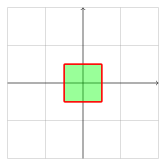

Triangle
--------

Creates a triangle, a positive ``SimpleShape`` instance from given ``side`` and ``center``

.. code-block:: python
   
   from compmec.shape import Primitive
   triangle = Primitive.triangle(side = 1, center = (0, 0))

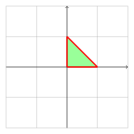

Polygon
-------

Creates a polygon for given ``vertices``, a positive ``SimpleShape`` instance

.. code-block:: python
   
   from compmec.shape import Primitive
   vertices = [(1, 0),(0, 1), (-1, 1), (0, -1)]
   simple = Primitive.polygon(vertices)

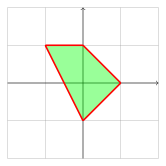

Regular polygon
---------------

Creates a regular polygon, a positive ``SimpleShape`` instance

.. code-block:: python
   
   from compmec.shape import Primitive
   triangle = Primitive.regular_polygon(nsides = 3, radius = 1, center = (0, 0))
   square = Primitive.regular_polygon(nsides = 4, radius = 1, center = (0, 0))
   pentagon = Primitive.regular_polygon(nsides = 5, radius = 1, center = (0, 0))

|reg3|  |reg4|  |reg5|

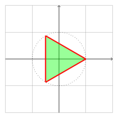

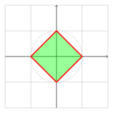

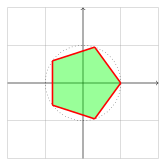

--------------------------------------------------------------------------------

---------------
Transformations
---------------

Move
----

Translate the entire shape by an amount ``(x, y)``

.. code-block:: python
   
   from compmec.shape import Primitive
   # Creates a circle of radius 1 and centered at origin (0, 0)
   circle = Primitive.circle()
   # Now the circle has radius 1 and center at (1, 2)
   circle.move(1, 2)

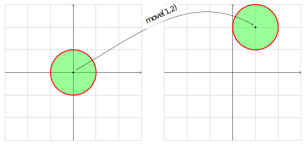

------------------------------------------------------------------------------------------

Rotate
------

Rotate counter-clockwise the entire shape

.. code-block:: python

   import math
   from compmec.shape import Primitive
   # Create square of side 2
   square = Primitive.square(side = 2)
   # Rotate the square in pi/6 radians
   square.rotate(math.pi/6)
   # Or in 30 degrees
   square.rotate(30, degrees = True)

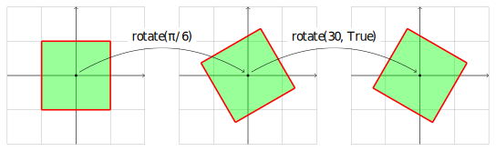

------------------------------------------------------------------------------------------

Scale
-----

Scale the entire shape in horizontal and vertical directions

.. code-block:: python

   from compmec.shape import Primitive
   # Create square of side 2
   square = Primitive.square(side = 2)
   # Scales a square into a rectangle of width 2 and height 0.5
   square.scale(2, 0.5)

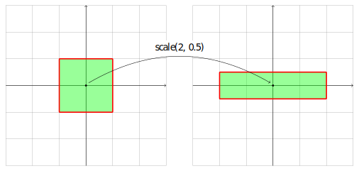

------------------------------------------------------------------------------------------

Invert
------

It's possible to invert the orientation of a shape.

.. code-block:: python

   from compmec.shape import Primitive
   # Create any shape, positive at counter-clockwise
   circle = Primitive.circle()
   # Change orientation to clockwise, negative
   circle.invert()

|pic1|  |pic2|

.. |pic1| image:: ../img/primitive/positive_circle.svg
   :width: 49 %

.. |pic2| image:: ../img/primitive/negative_circle.svg
   :width: 49 %

.. note::

   The ``invert`` function is available only in ``SimpleShape``. Use ``~shape`` for a inversion as general

------------------------------------------------------------------------------------------

------------------
Boolean Operations
------------------

It's possible to operate between two shapes by using ``|``, ``&``, ``-`` and ``^``:

Union / logic OR
----------------------

The sum between two shapes is mathematically a union of two sets

.. code-block:: python

   from compmec.shape import Primitive
   # Create two simple shapes
   circle = Primitive.circle()
   square = Primitive.square()
   # Union
   newshape = circle | square
   newshape = circle + square

.. figure:: ../img/primitive/setAorB.svg
   :width: 40%
   :alt: Schema of adding sets :math:`A` and :math:`B`
   :align: center

.. figure:: ../img/primitive/or_table.svg
   :width: 80%
   :alt: Table of union between two positive circles
   :align: center

------------------------------------------------------------------------------------------

Subtraction
-----------

The subtraction between two positive shapes means take out all part of :math:`A` such is inside :math:`B`. 

.. code-block:: python

   from compmec.shape import Primitive
   # Create two positive shapes
   circle = Primitive.circle()
   square = Primitive.square()
   # Subtract
   newshape = circle - square

.. figure:: ../img/primitive/setAminusB.svg
   :width: 40%
   :alt: Schema of subtraction between sets :math:`A` and :math:`B`
   :align: center

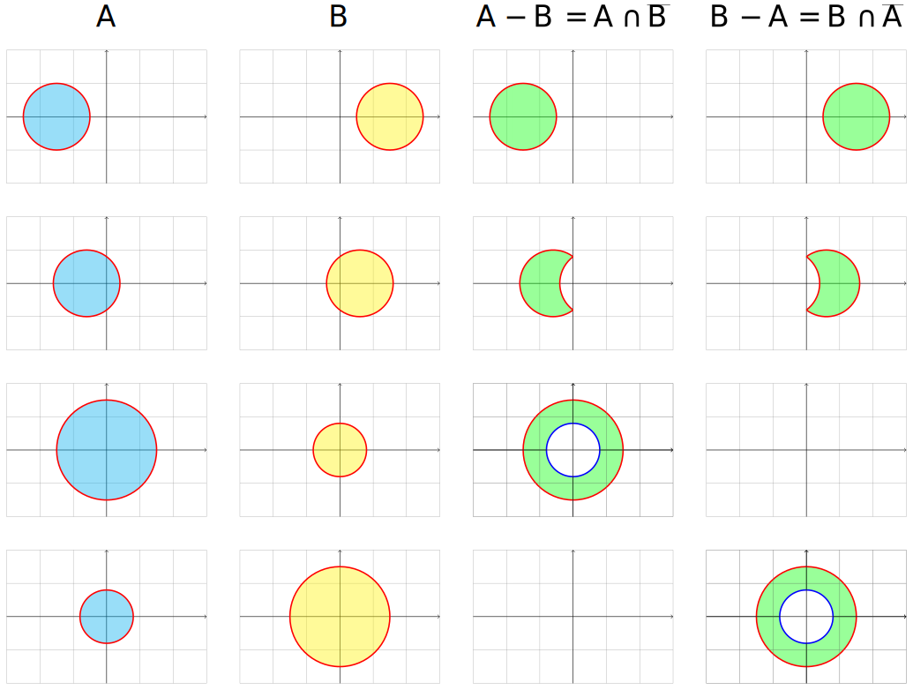

------------------------------------------------------------------------------------------

Intersection / logic AND / Multiplication
-----------------------------------------

The intersection between two shapes returns the common region between them.

.. code-block:: python

   # Create two positive shapes
   circle = section.shape.primitive.circle()
   square = section.shape.primitive.square()
   # Subtract
   newshape = circle * square
   newshape = circle & square

.. figure:: ../img/primitive/setAandB.svg
   :width: 40%
   :alt: Example of multiplication between two positive shapes
   :align: center

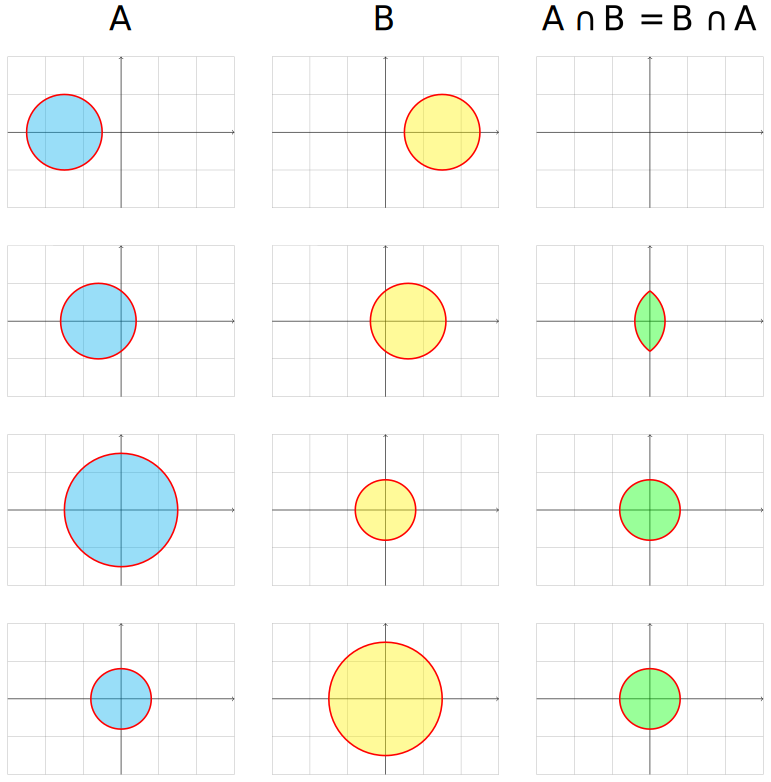

------------------------------------------------------------------------------------------

XOR Operator
------------

The xor between two positive shapes. For this operator, we use the symbol ``^``.

.. code-block:: python

   # Create two positive shapes
   circle = section.shape.primitive.circle()
   square = section.shape.primitive.square()
   # Subtract
   newshape = circle ^ square

.. figure:: ../img/primitive/setAxorB.svg
   :width: 40%
   :alt: Example of XOR between two positive shapes
   :align: center

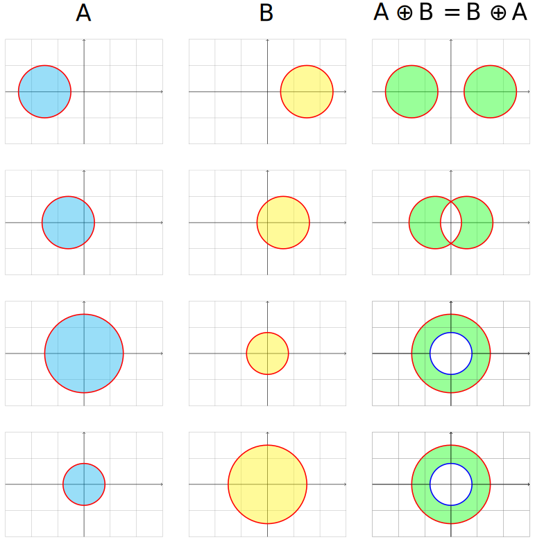

------------------------------------------------------------------------------------------

Rewrite operations
------------------

All the sub-operations (``+``, ``-``, ``*``, ``^``) operations are in fact only combinations of ``|``, ``&`` and ``~``. On the background, it works only with these three and the other operations are transformed:

* The ``A + B`` is transformed to ``A | B``
* The ``A * B`` is transformed to ``A & B``
* The ``A - B`` is transformed to ``A & (~B)``
* The ``A ^ B`` is transformed to ``(A - B) | (B - A)``

.. image:: ../img/primitive/all_bool_operations.svg
   :width: 100 %
   :alt: Operations between two positives simple shapes
   :align: center