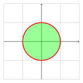
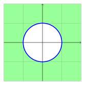
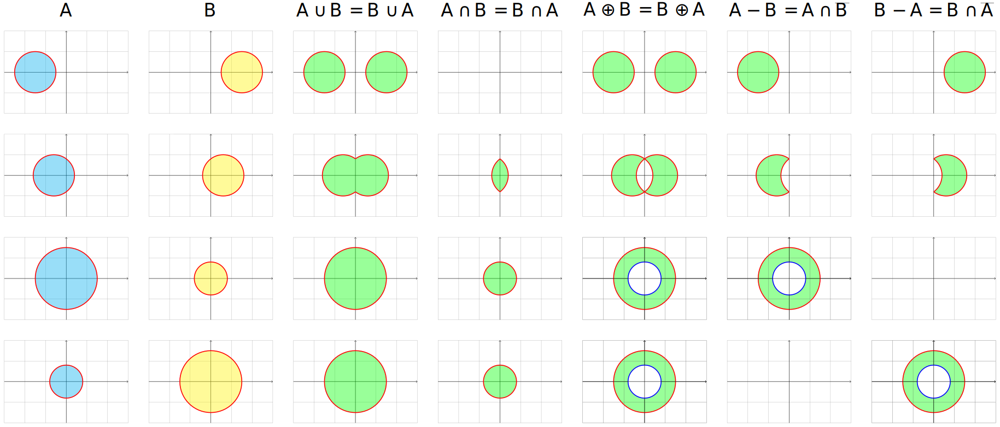
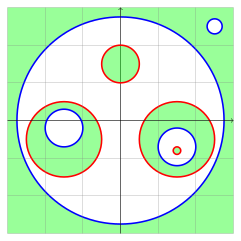

.. _shapes:

======
Shapes
======

------------
Introduction
------------

A ``shape`` represents a region on the plane and are divided in 5 types:

* ``EmptyShape``, mathematically it's the empty set with no interior points
* ``WholeShape``, mathematically it's the set with all the points in plane
* ``SimpleShape``, is represented by only one jordan curve, 
* ``ConnectedShape``, is the intersection some ``SimpleShape``
* ``DisjointShape``, is the union of some ``ConnectedShape``

For any pair of shapes, you can use operators:

* ``|`` - Union (OR)
* ``&`` - Intersection (AND)
* ``-`` - Subtraction
* ``^`` - XOR
* ``~`` - Inversion
* ``in`` - Contains

---------------
Empty and Whole
---------------

They are singleton objects which are used to be returned in boolean operations.

For example, there are some sta

.. code-block:: python
   
   from shapepy import EmptyShape, WholeShape
   
   empty = EmptyShape()
   whole = WholeShape()

   empty | whole is whole  # OR
   empty & whole is empty  # AND
   empty ^ whole is whole  # XOR
   empty - whole is empty  # SUB
   whole - empty is whole  # SUB
   ~empty is whole  # Invert
   ~whole is empty  # Invert
   empty in whole  # Contains
   whole not in empty  # Contains

They are returned when, for any ``shape``:

.. code-block:: python
   
   shape | (~shape)  # WholeShape
   shape & (~shape)  # EmptyShape
   shape - shape  # EmptyShape
   shape ^ shape  # EmptyShape
   shape ^ (~shape)  # WholeShape

-------------------------------------------------------------------------------

---------------
Simple Shape
---------------

This shape is described by only one ``JordanCurve``.

* If the jordan curve is counter-clockwise (positive),
    * The simple shape will be the interior of the curve 
* If the jordan curve is clockwise (negative),
    * The simple shape will be the exterior of the curve

As example, bellow we have a positive (left image) and a negative circle (right image).

|pic1|  |pic2|

    

The easiest way to create it is by using ``Primitive``,
which allows creating many simple shapes, like ``square`` and ``circle``

.. code-block:: python
   
   from shapepy import Primitive
   my_square = Primitive.square()
   my_circle = Primitive.circle()

You can also create your custom ``SimpleShape`` by using a passing a ``JordanCurve``

.. code-block:: python
   
   from shapepy import JordanCurve, SimpleShape
   vertices = [(0, 0), (4, 0), (0, 3)]
   jordan = FactoryJordan.polygon(vertices)
   simple = SimpleShape(jordan)

It's possible to operate between two simple shapes:

.. code-block:: python
   
   from shapepy import Primitive
   my_square = Primitive.square()
   my_circle = Primitive.circle()

   ~my_square  # INVERT
   my_square | my_circle  # OR
   my_square & my_circle  # AND
   my_square - my_circle  # SUB
   my_square ^ my_circle  # XOR
   (0, 0) in my_square  # Contains
   my_square in my_circle  # Contains

You find bellow a table with the basic operations between two positive circles (simple shapes).

-------------------------------------------------------------------------------

---------------
Connected Shape
---------------

This shape is described by the intersection of simple shapes:

.. math::

    C = \bigcap_i S_i

Two examples of connected shapes are bellow.

|pic3|  |pic4|

.. |pic3| image:: ../img/shape/hollow_circle.svg
   :width: 49 %

.. |pic4| image:: ../img/shape/two_holes.svg
   :width: 49 %

The easiest way to create them is by operating between shapes. For example:

.. code-block:: python
   
   from shapepy import Primitive
   
   big_circle = Primitive.circle(radius = 2)
   small_circle = Primitive.circle(radius = 1)
   hollow_circle = big_circle - small_circle

It's also possible to create directly the ``ConnectedShape`` instance, but it may raise ``ValueError`` if the input is wrong:

.. code-block:: python
   
   from shapepy import Primitive, ConnectedShape
   
   big_circle = Primitive.circle(radius = 2)
   small_circle = Primitive.circle(radius = 1)
   hollow_circle = ConnectedShape([big_circle, ~small_circle])

--------------------
Disjoint Shape
--------------------

This shape is described by the union of simple and connected shapes:

.. math::
    D = \left(\bigcup_j S_j\right) \cup \left(\bigcup_i C_i\right) 

Some examples of disjoint shapes are

|pic5|  |pic6|

.. |pic5| image:: ../img/shape/centered_circles.svg
   :width: 49 %

The easiest way to create them is by operating shapes. For example, the code bellow creates the respective figure.

.. code-block:: python
   
   from shapepy import Primitive, ConnectedShape
   
   left = Primitive.circle(radius = 1, center = (-1.5, 0))
   right = Primitive.circle(radius = 1, center = (1.5, 0))
   disjoint = left | right

.. image:: ../img/shape/two_circles.svg
   :width: 50 %
   :alt: Example of disjoint shape created by union of two circles
   :align: center

You can also create directly

.. code-block:: python
   
   from shapepy import Primitive, DisjointShape
   
   left = Primitive.circle(radius = 2)
   right = Primitive.circle(radius = 1)
   hollow_circle = ConnectedShape([big_circle, ~small_circle])

--------------------
Boolean Operations
--------------------

The boolean operations can be tricky, bellow you find tables for operations between two shapes.
We represent the shapes categories as :math:`E` (empty),  :math:`W` (whole), :math:`S` (simple), :math:`C` (connected) and :math:`D` (disjoint) 

.. list-table:: Table for possible results of ``~B``
    :widths: 20 20 20 20 20
    :header-rows: 1
    :align: center

    * - :math:`E`
      - :math:`W`
      - :math:`S`
      - :math:`C`
      - :math:`D`
    * - :math:`W`
      - :math:`E`
      - :math:`S`
      - :math:`D`
      - :math:`C`, :math:`D`

.. list-table:: Table for possible results of ``A | B``
    :widths: 20 20 20 20 20 20
    :header-rows: 1
    :align: center

    * - 
      - :math:`E`
      - :math:`W`
      - :math:`S`
      - :math:`C`
      - :math:`D`
    * - :math:`E`
      - :math:`E`
      - :math:`W`
      - :math:`S`
      - :math:`C`
      - :math:`D`
    * - :math:`W`
      - :math:`W`
      - :math:`W`
      - :math:`W`
      - :math:`W`
      - :math:`W`
    * - :math:`S`
      - :math:`S`
      - :math:`W`
      - :math:`W`, :math:`S`, :math:`C`, :math:`D`
      - :math:`W`, :math:`S`, :math:`C`, :math:`D`
      - :math:`W`, :math:`S`, :math:`C`, :math:`D`
    * - :math:`C`
      - :math:`C`
      - :math:`W`
      - :math:`W`, :math:`S`, :math:`C`, :math:`D`
      - :math:`W`, :math:`S`, :math:`C`, :math:`D`
      - :math:`W`, :math:`S`, :math:`C`, :math:`D`
    * - :math:`D`
      - :math:`D`
      - :math:`W`
      - :math:`W`, :math:`S`, :math:`C`, :math:`D`
      - :math:`W`, :math:`S`, :math:`C`, :math:`D`
      - :math:`W`, :math:`S`, :math:`C`, :math:`D`

.. list-table:: Table for possible results of ``A & B``
    :widths: 20 20 20 20 20 20
    :header-rows: 1
    :align: center

    * - 
      - :math:`E`
      - :math:`W`
      - :math:`S`
      - :math:`C`
      - :math:`D`
    * - :math:`E`
      - :math:`E`
      - :math:`E`
      - :math:`E`
      - :math:`E`
      - :math:`E`
    * - :math:`W`
      - :math:`E`
      - :math:`W`
      - :math:`S`
      - :math:`C`
      - :math:`D`
    * - :math:`S`
      - :math:`E`
      - :math:`S`
      - :math:`E`, :math:`S`, :math:`C`, :math:`D`
      - :math:`E`, :math:`S`, :math:`C`, :math:`D`
      - :math:`E`, :math:`S`, :math:`C`, :math:`D`
    * - :math:`C`
      - :math:`E`
      - :math:`C`
      - :math:`E`, :math:`S`, :math:`C`, :math:`D`
      - :math:`E`, :math:`S`, :math:`C`, :math:`D`
      - :math:`E`, :math:`S`, :math:`C`, :math:`D`
    * - :math:`D`
      - :math:`E`
      - :math:`D`
      - :math:`E`, :math:`S`, :math:`C`, :math:`D`
      - :math:`E`, :math:`S`, :math:`C`, :math:`D`
      - :math:`E`, :math:`S`, :math:`C`, :math:`D`

.. list-table:: Table for possible results of ``A - B``
    :widths: 20 20 20 20 20 20
    :header-rows: 1
    :align: center

    * - 
      - :math:`E`
      - :math:`W`
      - :math:`S`
      - :math:`C`
      - :math:`D`
    * - :math:`E`
      - :math:`E`
      - :math:`E`
      - :math:`E`
      - :math:`E`
      - :math:`E`
    * - :math:`W`
      - :math:`W`
      - :math:`E`
      - :math:`S`
      - :math:`D`
      - :math:`C, D`
    * - :math:`S`
      - :math:`S`
      - :math:`E`
      - :math:`E`, :math:`S`, :math:`C`, :math:`D`
      - :math:`E`, :math:`S`, :math:`C`, :math:`D`
      - :math:`E`, :math:`S`, :math:`C`, :math:`D`
    * - :math:`C`
      - :math:`C`
      - :math:`E`
      - :math:`E`, :math:`S`, :math:`C`, :math:`D`
      - :math:`E`, :math:`S`, :math:`C`, :math:`D`
      - :math:`E`, :math:`S`, :math:`C`, :math:`D`
    * - :math:`D`
      - :math:`D`
      - :math:`E`
      - :math:`E`, :math:`S`, :math:`C`, :math:`D`
      - :math:`E`, :math:`S`, :math:`C`, :math:`D`
      - :math:`E`, :math:`S`, :math:`C`, :math:`D`

.. list-table:: Table for possible results of ``A ^ B``
    :widths: 20 20 20 20 20 20
    :header-rows: 1
    :align: center

    * - 
      - :math:`E`
      - :math:`W`
      - :math:`S`
      - :math:`C`
      - :math:`D`
    * - :math:`E`
      - :math:`E`
      - :math:`W`
      - :math:`S`
      - :math:`C`
      - :math:`D`
    * - :math:`W`
      - :math:`W`
      - :math:`E`
      - :math:`S`
      - :math:`D`
      - :math:`C`, :math:`D`
    * - :math:`S`
      - :math:`S`
      - :math:`S`
      - any
      - any
      - any
    * - :math:`C`
      - :math:`C`
      - :math:`D`
      - any
      - any
      - any
    * - :math:`D`
      - :math:`D`
      - :math:`C`, :math:`D`
      - any
      - any
      - any