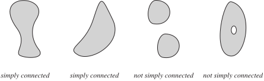
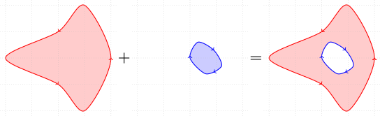
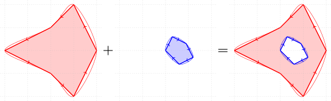
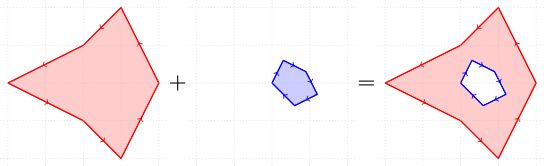

Theoretical Background
======================

Introduction
------------

Shape Generation
----------------

Jordan Curve
^^^^^^^^^^^^

`Jordan Curve <https://mathworld.wolfram.com/JordanCurve.html>`_ is a continuous closed curve which doesn't intersect itself.

For our purpose, we use oriented jordan curve by setting a **positive** direction: **counter-clockwise**.

A jordan curve defines a `simply connected <https://mathworld.wolfram.com/SimplyConnected.html>`_ regions. By adding and subtracting regions, it's possible to more complex shapes as **not simply connected**.

Although a jordan curve is more general, we discretize it to get a polygon.
More points used in discretization, more realiable the final results will be, by also increasing the computational cost.

.. note::
   Even if your original jordan curve is already a polygon, maybe it's needed to discretize the edges due to the boundary elements, which we will see further. 
